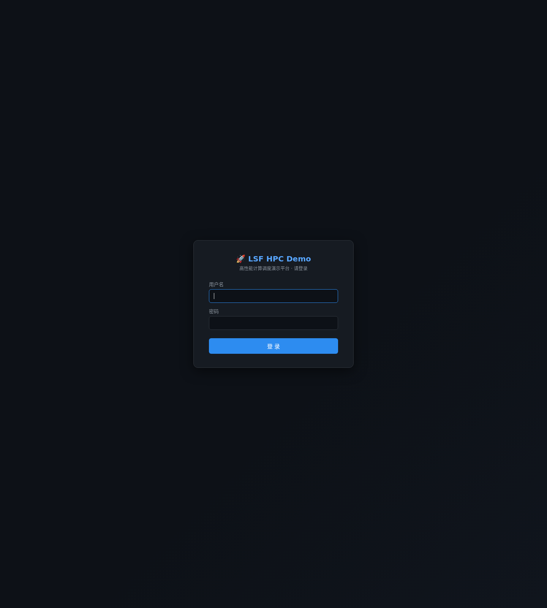
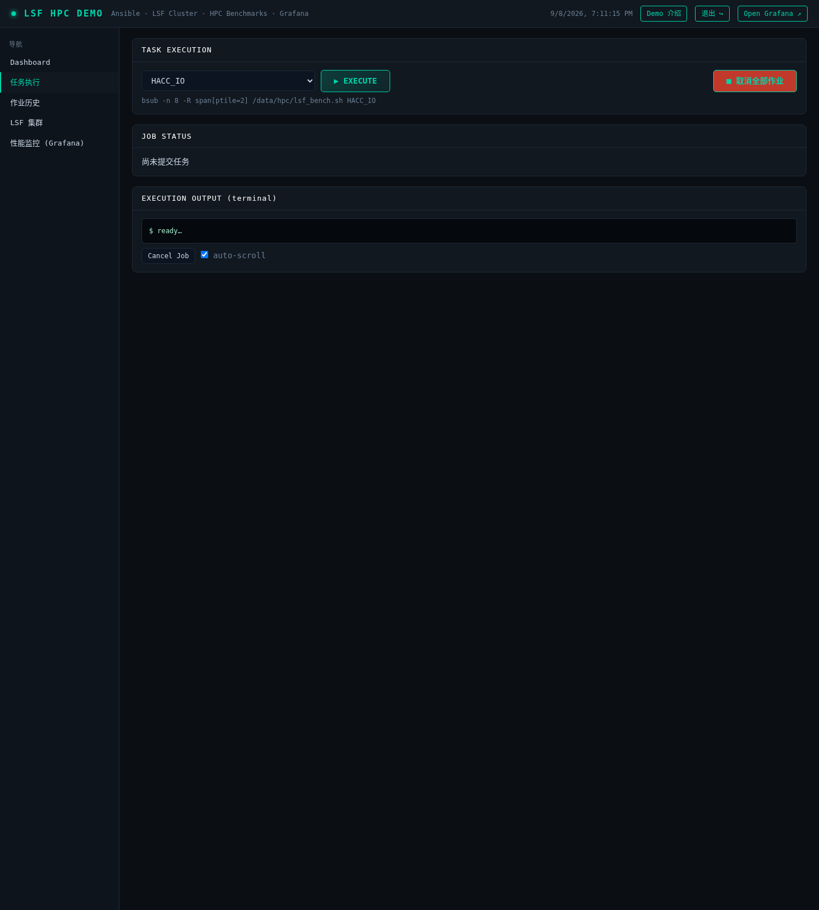
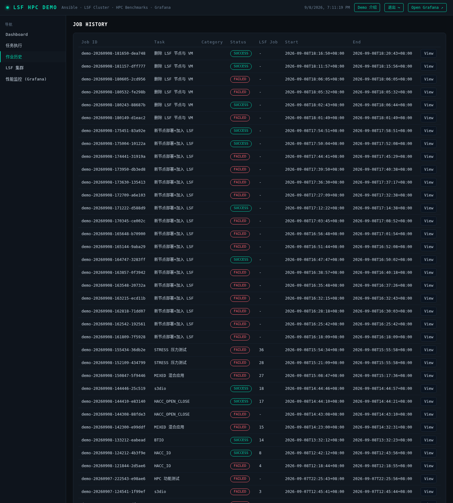
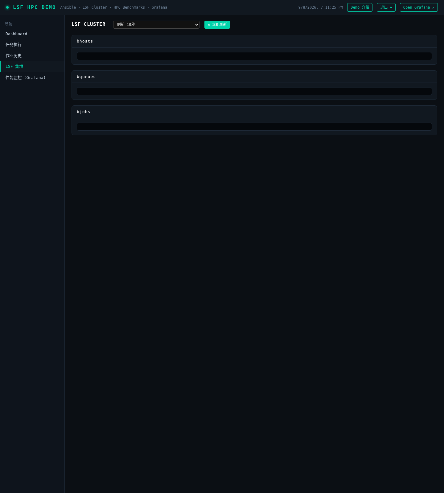
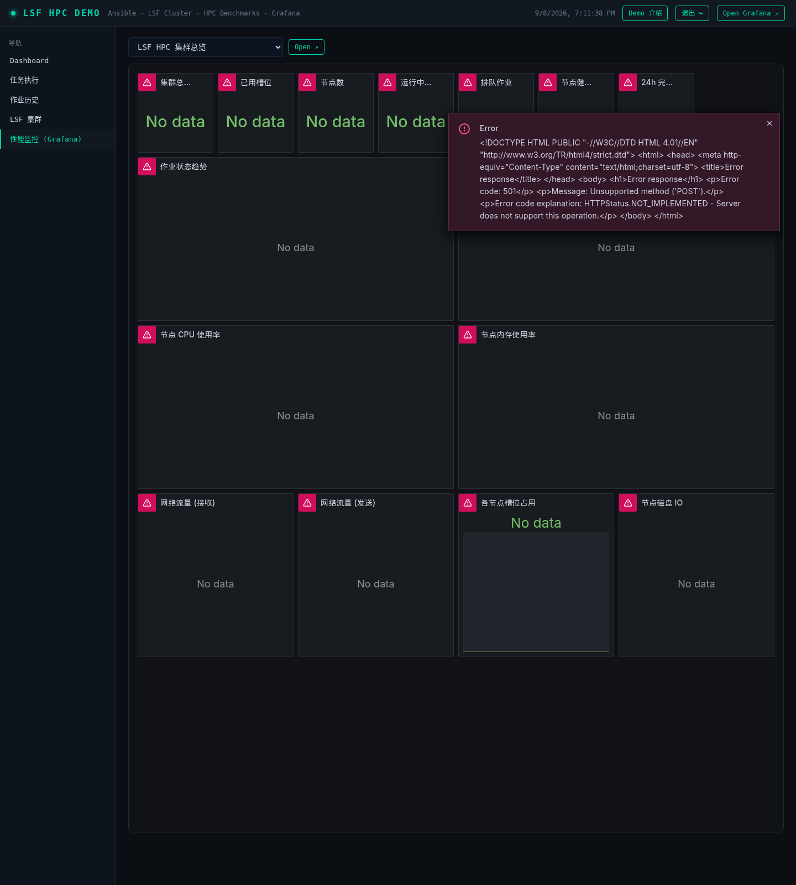

# 🚀 LSF HPC Demo 用户手册

> 高性能计算调度演示平台 · 访问地址 `http://<服务器IP>:8080` · 账号请向管理员获取

---

## 一、平台概览

LSF HPC Demo 基于 IBM Spectrum LSF 构建，覆盖**集群部署 → 作业调度 → HPC 应用运行 → 监控告警**全链路。登录后共 5 个功能页面（左侧导航）：

| 页面 | 功能 |
|------|------|
| 概览仪表盘 | 集群/队列/作业关键指标一览 |
| 任务执行 | 提交 LSF 作业与 HPC 基准、参数化扩缩容节点 |
| 作业历史 | 全部作业记录、终端输出回放 |
| LSF 集群 | bhosts/bqueues/bjobs 实时视图 + 负载趋势 |
| 性能监控 | 内嵌 Grafana 大盘（节点/集群/作业指标） |

---

## 二、用户登录


*图 1 · 登录页面*

1. 浏览器访问门户地址，自动跳转登录页
2. 输入用户名、密码（本演示环境：`admin / lsfhpcdemo`），点击「登 录」或回车
3. 认证通过后进入概览仪表盘；密码错误会红字提示
4. 右上角「退出 ↪」可注销会话（有确认提示）

> 💡 所有页面与 API 均需登录后访问，未登录访问会自动跳回登录页。

---

## 三、任务执行




*图 2 · 任务执行页面*

### 3.1 提交 HPC 基准作业

1. 左侧导航选择「任务执行」
2. 任务类型选择 **HPC 基准应用**，出现蓝色参数面板
3. 选择应用（HACC_IO / HACC_OPEN_CLOSE / BTIO / MADbench / s3d_io）与并行规模（槽位数）
4. 点击 **EXECUTE**，系统等价执行：
   ```bash
   bsub -J demo_<应用> -n <槽位> -R "span[ptile=<每节点>]" \
        -o /data/hpc/lsf_logs/%J.out /data/hpc/lsf_bench.sh <应用>
   ```
5. 页面实时显示作业状态（PEND → RUN → DONE/EXIT）与结果摘要（带宽 GiB/s、退出码）
6. 需要中止时点击「取消全部作业」（bkill）

> ⚠️ BTIO / MADbench 需平方数进程（4/9/16…）；s3d_io 必须指定输出目录；槽位不足会排队等待。

### 3.2 集群扩容（新节点部署+加入 LSF）

1. 任务类型选择「新节点部署+加入 LSF」，填写 **Master IP**、**新节点 IP**（可选主机名）
2. 点击 EXECUTE 后全自动：克隆黄金镜像 → 定制主机名/IP → 入集群文件 → reconfig → 验证入池
3. 完成后在「LSF 集群」页确认新节点状态 ok（reconfig 后 30s~1min 内转 ok 属正常）

### 3.3 集群缩容（删除 LSF 节点与 VM）

1. 任务类型选择「删除 LSF 节点与 VM」，红色面板中输入**待删除节点 IP**
2. 二次确认后执行：节点出集群 → 销毁 KVM 虚机 → 删除磁盘镜像 → 清理残留
3. 初始节点（master 与首批计算节点）受保护，禁止删除

---

## 四、作业历史




*图 3 · 作业历史页面*

1. 左侧导航选择「作业历史」，列出全部提交过的门户作业
2. 每条记录含：作业 ID、类型、状态（RUNNING/SUCCESS/FAILED）、提交时间
3. 点击记录可**回放终端输出**（Ansible 步骤、bsub 交互、基准结果）
4. 历史持久化在服务器 `/var/lib/lsf-demo/jobs/`，重启门户不丢失

---

## 五、LSF 集群




*图 4 · LSF 集群页面*

1. 左侧导航选择「LSF 集群」，三张实时表：**bhosts**（节点/状态/槽位/负载）、**bqueues**（队列）、**bjobs**（当前作业）
2. 自动刷新可选 5/10/20/30 秒，另有节点负载趋势图
3. 状态说明：`ok` 正常；`closed_Adm` 被管理员关闭；`unreach` 守护重启/网络瞬态（通常 1 分钟内恢复）
4. 常用等价命令行：`bhosts` / `bqueues` / `bjobs -w`（master 上执行）

---

## 六、性能监控




*图 5 · 性能监控页面（内嵌 Grafana）*

1. 左侧导航选择「性能监控」，内嵌 Grafana 大盘（15 个面板）
2. 指标维度：CPU/内存/磁盘 IO/网络（node_exporter）+ LSF 作业状态/槽位利用率/队列深度/24h 完成量（自研 lsf_exporter）
3. 顶部可切换时间范围（15m/1h/6h/24h…）与自动刷新
4. 独立访问 Grafana：`http://<服务器IP>:3000`（匿名只读）

---

## 七、常见问题（FAQ）

- **作业一直 PEND？** 槽位不足或被队列限制，在「LSF 集群」页看 bhosts 槽位与 bqueues 限制；减少 -n 或等前置作业结束。
- **节点 unreach？** 多为 reconfig/守护重启瞬态，等待 1 分钟；持续不恢复可在 master 上 `lsadmin limrestart` 排查。
- **提交后页面无响应？** 查「作业历史」状态与回放输出；演示环境请勿重启门户容器（会中断轮询，LSF 侧作业不受影响）。
- **基准结果在哪？** 作业输出在 `/data/hpc/lsf_logs/<jobid>.out`，门户执行页也有结果摘要。
- **MIXED / STRESS 是什么？** 混合应用（六阶段流水线）与集群压力测试，供进阶演示，时长约 30min / 15min。

---

*LSF HPC Demo 用户手册 · 2026-09-08* · [返回 README](README.md)
